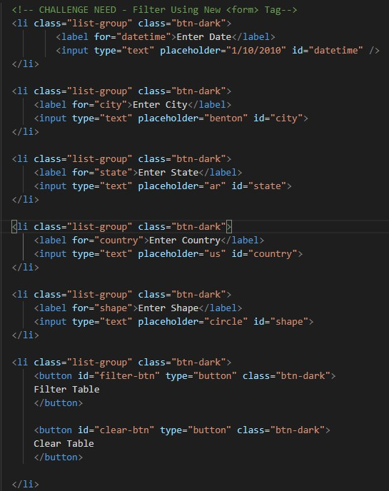
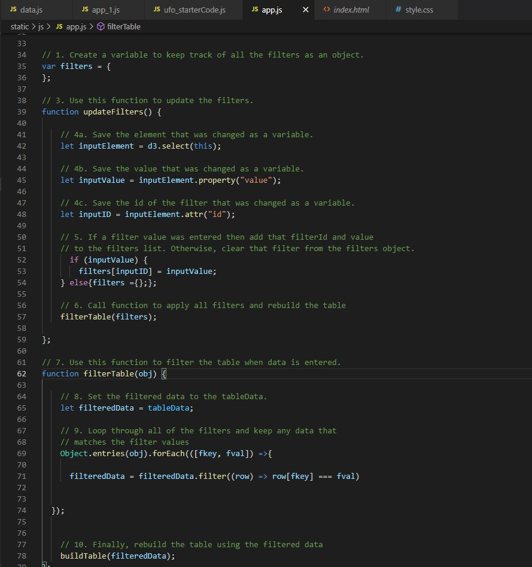
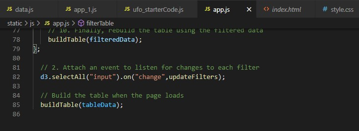
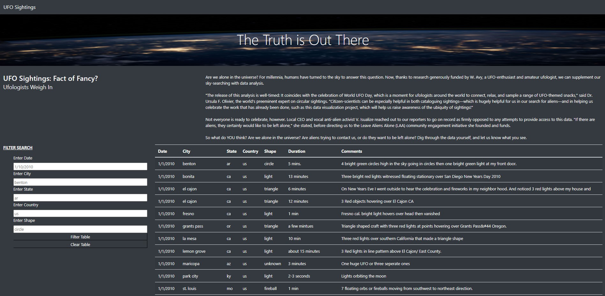
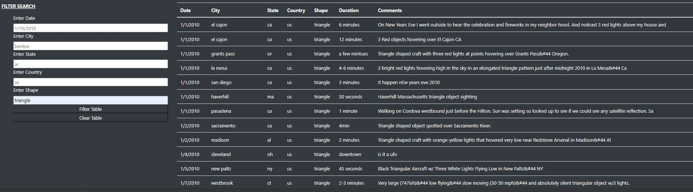

# UFOs
## Overview of Project
### Dana’s webpage and dynamic table are working as intended, but she’d like to provide a more in-depth analysis of UFO sightings by allowing users to filter for multiple criteria at the same time. In addition to the date, you’ll add table filters for the city, state, country, and shape.

* Deliverable 1: Filter UFO sightings on multiple criteria
* Deliverable 2: A written report on the UFO analysis README.md.

